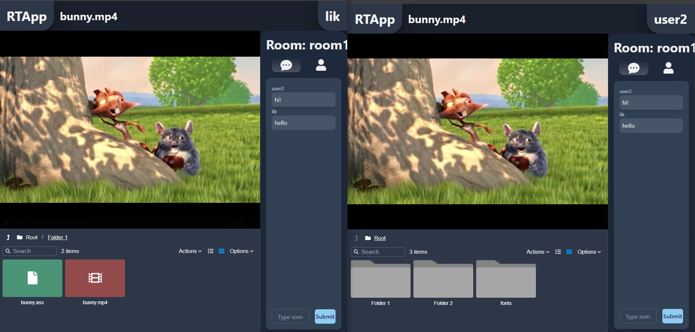

# RTAppCinema - real time app Cinema edition

## How to run:
### Backend:
- Configure appsettings.json to map files and fonts to correct location
- Build and run

### Frontend:
- npm install
- Add config.ts file and add string exports with backend endpoints: SERVER_URL, SERVER_STATIC, SERVER_HUB, SERVER_FILES_API, SERVER_LOGIN_API, SERVER_FONTS_API (export const SERVER_URL : string = "http://server";)
- npm run dev

### [Demo link](http://130.61.226.91/)

## Feautures
- Creating rooms with unique name
- Room creator becomes a host and have a special icon shown in room user list
- Every user in room will have the same video player state as host
- Chat in rooms
- File viewer with available videos
- Video list is served by backend, server folder for videos can be changed in appsettings.json
- Working .ass subtitles if there is a corresponding subtitles file with the same name as video
- Fonts folder which contains fonts for subtitles
- Change username by clicking your current username in up right corner
